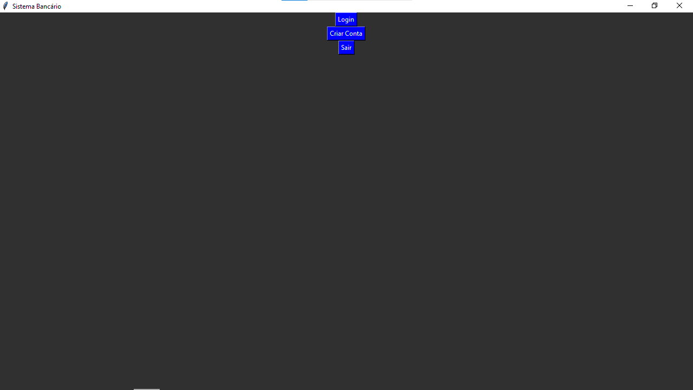
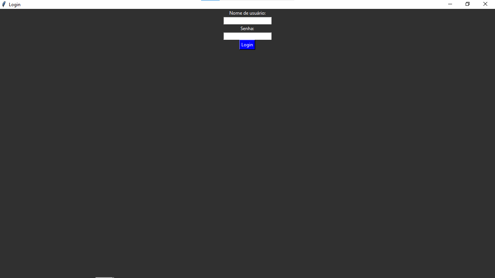
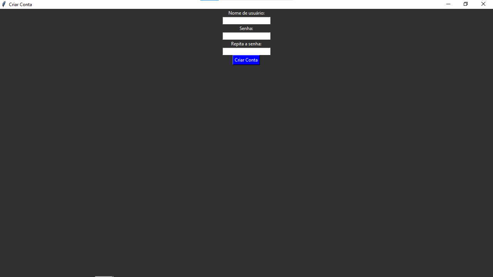
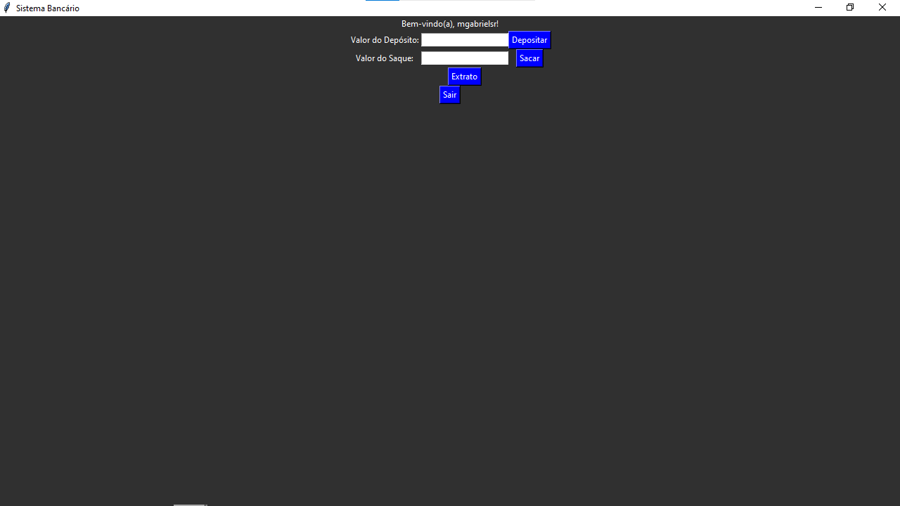
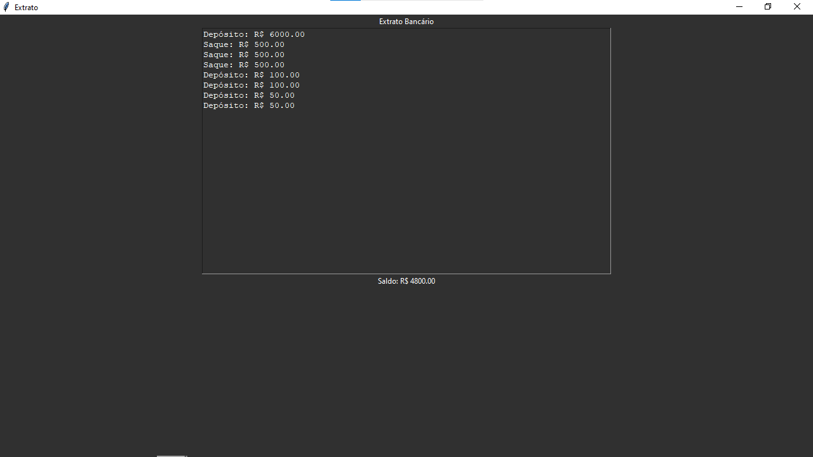
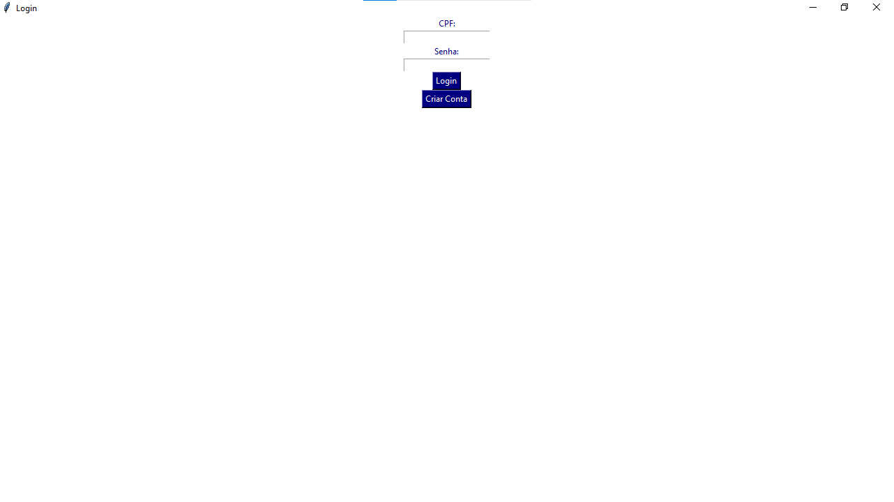
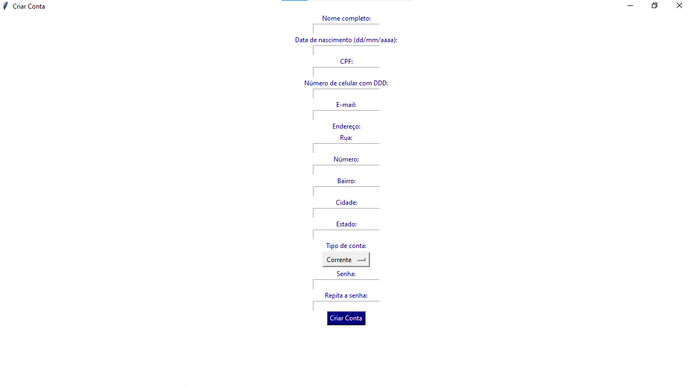
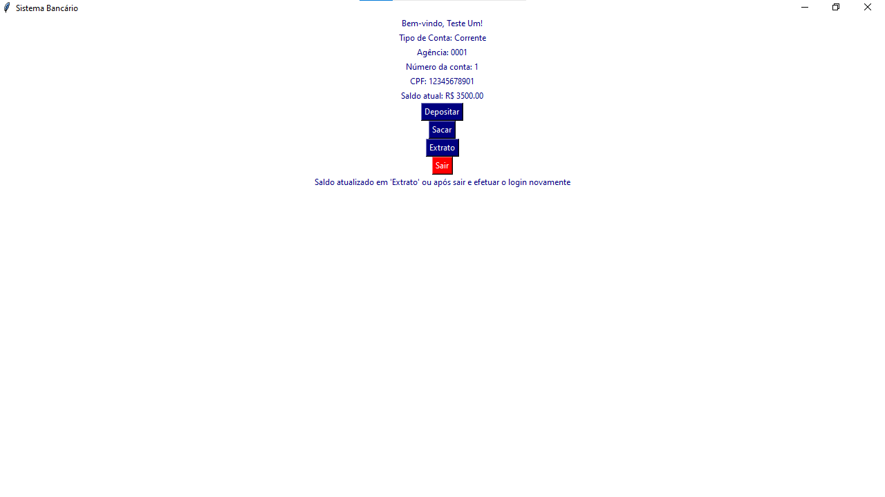
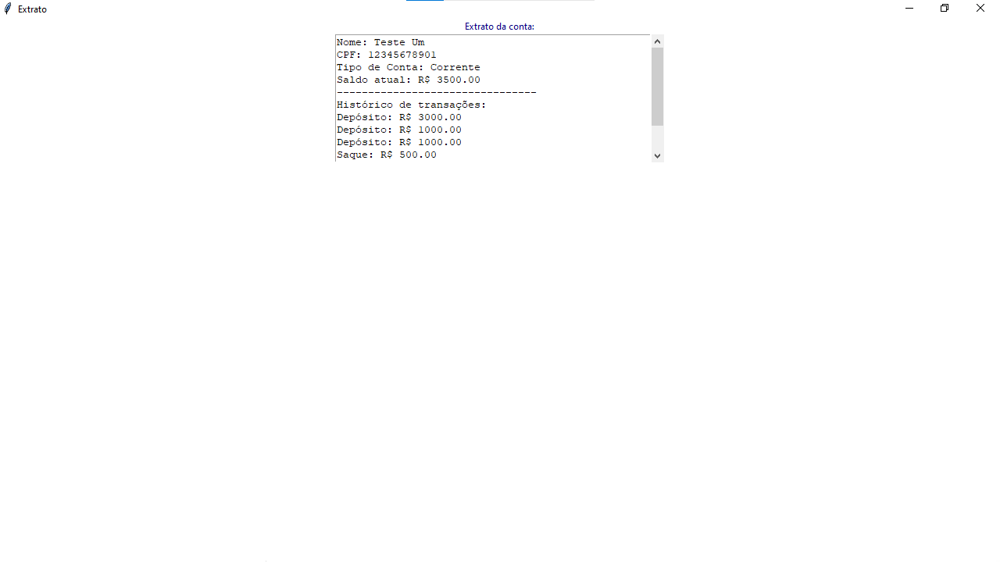

<h1 align="center">Sistema Bancário em Python com Interface Gráfica</h1>

## Sobre o Projeto
Este projeto é um sistema bancário simples desenvolvido em Python utilizando Tkinter para a interface gráfica. O sistema permite realizar operações como depósito, saque e visualização de extrato, além de criar e autenticar usuários com login e senha.

## Funcionalidades
- **Depósito:** Permite ao usuário depositar valores na conta bancária.
- **Saque:** Permite ao usuário realizar saques com limite diário e máximo por operação.
- **Extrato:** Mostra todas as operações realizadas na conta, incluindo depósitos e saques, além do saldo atual.
- **Autenticação de Usuário:** Permite criar uma conta com login e senha, e autenticar-se posteriormente para utilizar o sistema.

## Como Usar
Para usar o sistema:
1. Clone o repositório:
   ```
   git clone https://github.com/seu_usuario/seu_repositorio.git
   cd seu_repositorio
2. Execute o programa Python:
   ```
   python main.py
3. Na interface, escolha entre criar uma conta ou fazer login para acessar as funcionalidades bancárias.

## Tecnologias Utilzadas:


## Conecte-Se Comigo
[](https://www.dio.me/users/contato_marcosgabrielsr)
[](https://www.linkedin.com/in/gabriel-souza-b96389248/)
[](mailto:Contato.marcosgabrielsr@gmail.com)
[](https://github.com/mgabrielsr)
[](https://www.instagram.com/bieel.zp/)

## Screenshots









